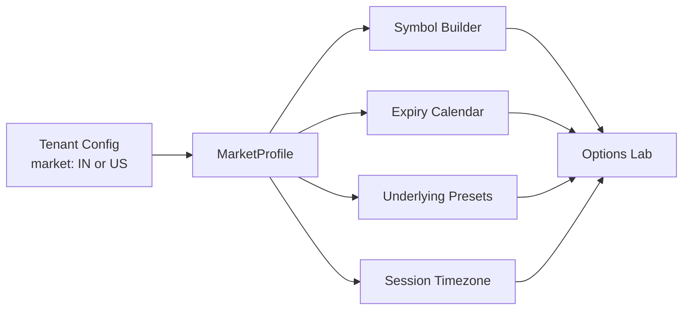
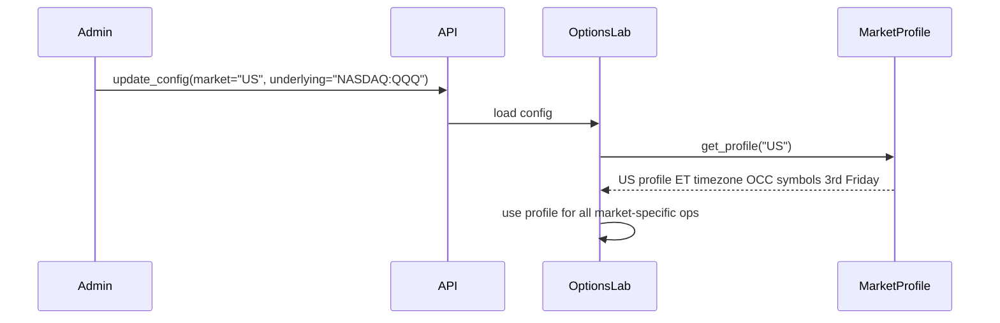

# Options Lab — Generic Market Profile

**Status:** Design only — implement later  
**Scope:** Make Options Lab market-generic (India NSE today, US equities/options next)  
**Default:** `market = "IN"` (zero behavior change for existing tenants)

---

## Why

Options Lab payoff math and screener columns are already market-neutral. Everything around them is India-specific:

| Area | Current (India) | Needed (US) |
|---|---|---|
| Symbol format | `NFO:NIFTY26AUG24500CE` | OCC `AAPL260815C00150000` |
| Underlying | Index futures (`NFO:NIFTY26AUGFUT`) | Equity spot (`AAPL`, `QQQ`) |
| Expiry calendar | Last Thursday (monthly) | Third Friday (monthly) |
| Session timezone | `Asia/Kolkata` (IST) | `America/New_York` (ET) |
| Strike step | 50 / 100 / 25 | 1 / 2.50 / 5 |
| Portfolio import | Kite positions API | Alpaca / IBKR positions |
| Option sides | `CE` / `PE` | `C` / `P` |

Without a market profile, Alpaca/IBKR tools alone will **not** make Options Lab work for US stocks/options.

---

## Core idea

Introduce a `MarketProfile` that encapsulates every market-specific behavior. Options Lab reads from the profile instead of hardcoding India/NSE conventions. Profile is selected per-tenant config.



---

## New module

**File:** `apps/backend/src/app/domains/market_profiles.py`

```python
@dataclass(frozen=True)
class MarketProfile:
    code: str                          # "IN", "US"
    timezone: str                      # "Asia/Kolkata", "America/New_York"
    option_sides: tuple[str, str]      # ("CE", "PE") or ("C", "P")
    default_underlying: str            # "NSE:NIFTY 50" or "NASDAQ:QQQ"
    default_label: str                 # "NIFTY 50" or "QQQ"
    default_strike_step: int           # 50 or 1
    underlying_presets: list[dict]     # [{label, symbol, strike_step}, ...]
    fut_root_map: dict[str, tuple]     # underlying -> (exchange, root)

    def suggest_fut_symbol(self, dt) -> str | None: ...
    def monthly_expiry_day(self, year, month) -> date: ...
    def parse_option_symbol(self, raw: str) -> ParsedOption | None: ...
    def build_option_symbol(self, root, expiry, strike, side) -> str: ...
    def canonical_broker_symbol(self, parsed) -> str: ...
    def option_exchange(self, root) -> str: ...
    def session_date(self, dt=None) -> str: ...
    def is_trading_day(self, dt) -> bool: ...
```

### India profile (`IN`)

- Expiry: last Thursday of month
- Symbols: `NFO:NIFTY26AUG24500CE`, `NFO:NIFTY26AUGFUT`
- Sides: `CE` / `PE`
- Timezone: `Asia/Kolkata`
- Presets: NIFTY 50, BANKNIFTY, FINNIFTY, SENSEX, MIDCPNIFTY
- Parse: existing 3 regexes (monthly, weekly-alpha, weekly-digits)

### US profile (`US`)

- Expiry: third Friday of month
- Symbols: OCC format `AAPL260815C00150000` (root + YYMMDD + C/P + 8-digit strike)
- Sides: `C` / `P`
- Timezone: `America/New_York`
- Presets: SPY, QQQ, AAPL, TSLA, AMZN, MSFT
- `suggest_fut_symbol` returns `None` (US equity options do not need a FUT)
- Parse: OCC regex

---

## Files to change (implementation checklist)

### Backend

1. **`apps/backend/src/app/domains/options_lab.py`** (biggest change)
   - Remove `FUT_ROOT_BY_UNDERLYING`, hardcoded defaults, `_last_thursday`, `_active_fut_month`, `suggest_fut_symbol`, `_ist_trading_day`, `_now_label`
   - Add `market: str = "IN"` on `OptionsLabConfig`
   - Instantiates `MarketProfile` from config and delegates market-specific calls
   - Screener / chain use `profile.session_date()` instead of IST
   - Warning/error strings become profile-driven (no hardcoded `"Kite"` / `"NFO"`)

2. **`apps/backend/src/app/domains/options_lab_portfolios.py`**
   - Move regexes / root lists into profile
   - `parse_option_symbol` → `profile.parse_option_symbol()`
   - `canonical_broker_option_symbol` → `profile.canonical_broker_symbol()`
   - `option_exchange` → `profile.option_exchange()`
   - `infer_fut_symbol_from_legs` uses profile
   - `kite_positions_payload` → generic `broker_positions_payload(profile, positions)`
   - Drop `"kite-"` leg id prefix → `"import-"`

3. **`apps/backend/src/app/domains/options_lab_iv.py`**
   - `_ist_trading_day()` → `profile.is_trading_day()`
   - Mock dates use `profile.timezone`

4. **`apps/backend/src/app/domains/signal_engine.py`**
   - Wrap `UNDERLYING_PRESETS` with `get_presets(market)`
   - `_derive_option_symbol()` → `profile.build_option_symbol()` (Signal Engine path)

5. **`apps/backend/src/app/domains/desk_snapshot.py`**
   - `quote_exchange()` / `quote_segment()` take optional `market`
   - US: bare symbols like `AAPL` stay as-is (no default `NSE:` prefix)
   - `quote_call_attempts()` adds a plain-symbol path for Alpaca/IBKR-style brokers

### Frontend

6. **`apps/web/src/components/domains/OptionsLabSetupBar.tsx`**
   - Drop `"Kite"` from mock-data label

7. **`apps/web/src/components/domains/OptionsLabPanel.tsx`**
   - Drop hardcoded `"Kite"` / `"IST"` strings; use config labels
   - `strike_step` fallback from profile default, not hardcoded `50`

8. **`apps/web/src/components/domains/OptionsLabScreenerPanel.tsx`**
   - `"Index F&O screener"` → `"Options screener"`
   - Search placeholder from presets, not `"NIFTY, BANKNIFTY…"`
   - `"Kite"` in errors → `"broker"`

### Already market-neutral (leave alone)

- `apps/web/src/components/domains/options-lab-strategy.ts` — payoff math
- Screener columns (PCR, max pain, IV, OI, straddle, IVP)
- Payoff / IV / straddle chart components
- Cache layer, tenant config CRUD
- `_fetch_quote` dispatch mechanism

---

## Config flow



---

## Migration / backward compatibility

- Default `market` is `"IN"` — existing tenants see zero behavior change
- India profile must contain the **exact** logic currently hardcoded (extract, do not rewrite)
- All existing tests must pass against the India profile
- New US tests: OCC parse, third-Friday expiry, ET session dates

---

## Out of scope (for this work)

- Signal Engine checklist metrics (stay India-specific for now; separate abstraction later)
- Broker toolkit contracts (`get_quote`, `get_ltp`, etc.) — already generic
- Live / Paper / Research chat flows — already broker-neutral
- Yahoo global market data — already multi-market
- Writing Alpaca / IBKR toolkits themselves (separate work; this only makes Options Lab ready to consume them)

---

## Implementation todos (when ready)

1. Create `market_profiles.py` with `MarketProfile` + `IN` / `US` profiles
2. Refactor `options_lab.py` to use `MarketProfile`
3. Refactor `options_lab_portfolios.py` symbol parsing to use profile
4. Update `options_lab_iv.py` timezone references
5. Add market-aware quote routing in `desk_snapshot.py`
6. Wrap `UNDERLYING_PRESETS` in `signal_engine.py`
7. Remove hardcoded Kite / IST / NIFTY references from the three frontend files
8. Add US profile unit tests + verify IN tests still pass

---

## Related context

- Options Lab today is India/NSE + Kite/Groww shaped.
- Research + Live trading can use Alpaca/IBKR for **US stocks** with a broker toolkit alone.
- Options Lab needs this market profile **before** US options work end-to-end.
